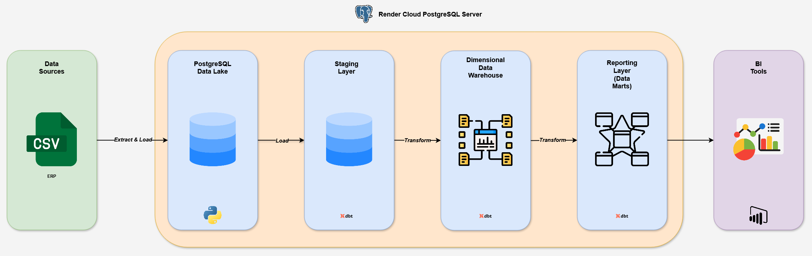

# 🪨 Otimizando as Operações da Astarte Mining Co. 

## 📜 Sumário
1. 📌 [Sobre o Projeto](#-sobre-o-projeto)
2. ⚙️ [Tecnologias Utilizadas](#️-tecnologias-utilizadas)
3. 🚀 [Como Executar](#-como-executar)
4. 📊 [Estrutura do Projeto](#-estrutura-do-projeto)
5. 🗒️ [Licença](#️-licença)
6. 📞 [Contato](#-contato)

## 📌 Sobre o Projeto

Este projeto tem como objetivo, a partir de dados gerados sinteticamente, modelar um Data Warehouse para armazená-los, realizar uma análise para otimizar as operações da Astarte Mining Company e criar um dashboard para o monitoramento das manutenções.

### Astarte Mining Co.
A mineradora Astarte atua na extração de minérios no interior do Brasil. Com relativamente pouco tempo de existência, a empresa ainda não possui uma cultura de dados estabelecida e gera seus relatórios exclusivamente por meio de seu ERP interno.

Diante da necessidade de otimizar e modernizar suas operações, o CEO identificou uma oportunidade de melhoria com a adoção de ferramentas de Business Intelligence (BI) e decidiu implementar um projeto piloto para avaliar seus benefícios.

Foram disponibilizados dados sobre máquinas, operadores, incidentes e manutenções, e o desafio proposto é:

1. Migrar os dados do ERP interno para um banco de dados em nuvem.
2. Criar um dashboard para monitoramento dos custos de manutenção.
3. Respondas às seguintes perguntas:
    - Qual o tempo de inatividade das máquinas e sua taxa de disponibilidade?
    - Qual o custo de manutenção por tipo de máquina, e máquina individualmente?
    - Qual a quantidade de incidentes por tipo de máquina?

## ⚙️ Tecnologias Utilizadas
- 🐍 **Python 3.12**
- 📊 **Microsoft Power BI (Data Viz)**
- 🏭 **dbt-core (Transformação dos Dados)**
- 🎲 **duckdb, Pandas, NumPy, Faker (Manipulação de Dados)**
- 🐘 **PostgreSQL - Render Cloud (Banco de Dados)**

## 🚀 Como Executar

**1️⃣ Clone o repositório**
```bash
git clone https://github.com/datalopes1/machine_stop.git
cd machine_stop
```
**2️⃣ Crie um ambiente virtual (recomendado)**
```bash
python -m venv .venv
source .venv/bin/activate  # Mac e Linux
.venv\Scripts\activate  # Windows
```

**3️⃣ Instale as dependências**
```bash
pip install -r pyproject.toml
```

**4️⃣ Gere os dados**
```bash
python scr/generate_data.py
```

**5️⃣ Faça a ingestão no banco de dados (após criar as tabelas)**
```bash
python scr/ingest_data.py
```

**6️⃣ Execute o projeto do dbt**
```bash
cd astarte_dw
dbt run
```

## 📊 Estrutura do Projeto

**Arquitetura do Data Warehouse**



**Estrutura**

```plaintext
machine_stop/
|-- astarte_dw/                     # Projeto do dbt-core
|-- data/                               
|   ├── raw/                        # Dados brutos gerados
|-- doc/                                
|   ├── img/                        # Imagens utilizadas na documentação
|   ├── source_to_target.xlsx       # Source to Target Mapping
|-- notebooks/                          
|   ├── analise.ipynb               # Análise exploratória de dados
|-- scr/
|   ├── create_tables.sql           # Query para criação de tabelas
|   ├── generate_data.py            # Script para gerar dados sintéticos
|   ├── ingest_data.py              # Script de ingestão de dados
|-- .gitignore                      # Arquivos e pastas ignoradas pelo Git
|-- pyproject.toml                  # Dependências
|-- README.md                       # Documentação do projeto
|-- LICENSE.md                      # Licença
```

## 🗒️ Licença
Este projeto está licenciado sob a MIT License - veja o arquivo [LICENSE](LICENSE.md) para mais detalhes.

## 📞 Contato
- 📩 datalopes1@proton.me
- 💻 https://www.linkedin.com/in/andreluizls1
- 💡 https://sites.google.com/view/datalopes1
- 📲 +55 88 99993-4237