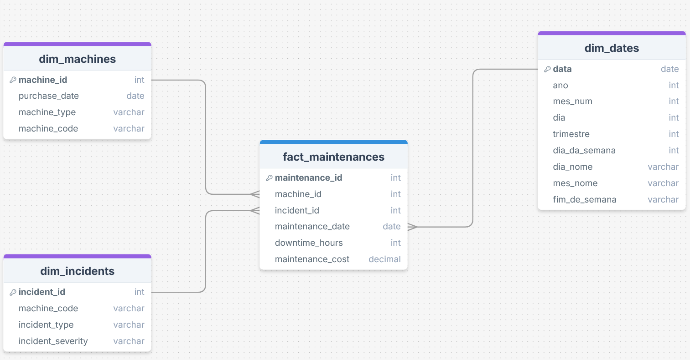

# 🏭 Astarte Data Warehouse

## 1. Processos de negócio

|Processo de Negócio|Tabela Fato|Tipo de Grão do Fato|Granularidade|machine|operator|incident|date|Prioridade|
|---|---|---|---|---|---|---|---|---|
|Manutenção|fact_maintenance|Transacão|Uma linha por manutenção|x| |x|x|Alta|

### 2. Granularidade
- **fact_maintenance**: Uma linha por manutenção.

### 3. Dimensões

|Dimensão|Atributos|
|---|---|
|**dim_machines**|`machine_id`, `purchase_date`, `machine_type`, `machine_code`, `operational_cost`|
|**dim_incidents**|`incident_id`, `machine_code`, `incident_type`, `incident_severity`|
|**dim_date**|``data``, ``ano``, ``mes_num``, ``dia``, ``trimestre``, ``dia_da_semana``, ``dia_nome``, ``mes_nome``, ``fim_de_semana``|

### 4. Fatos

**fact_maintenance**

|Coluna|Tipo|Descrição|
|---|---|---|
|**maintenance_id**|INT|Identificador único da manutenção|
|**machine_id**|INT|Identificador único da máquina|
|**incident_id**|INT|Identificador único do incidente|
|**maintenance_date**|DATE|Data da manutenção|
|**downtime_hours**|INT|Tempo de parada|
|**maintenance_cost**|FLOAT|Custo de manutenção|

### 5. Data Mart: Maintenance

